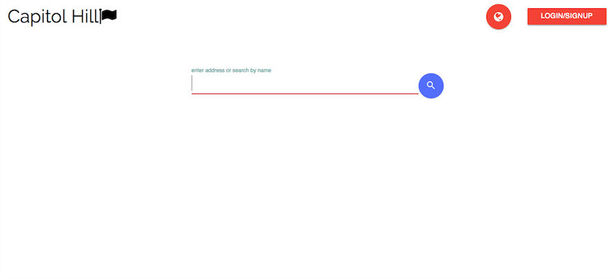
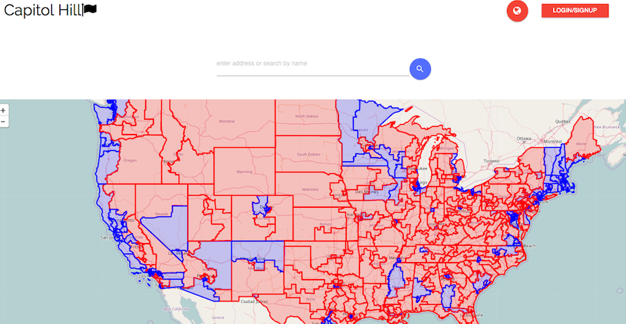
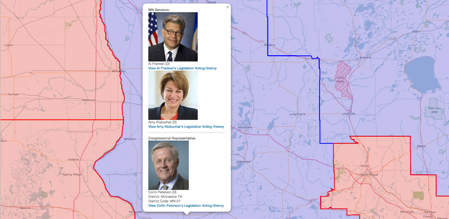

# Capitol Hill
Capitol Hill is an application designed to easily connect people with their Senators and Congressional representatives, and to keep constituents up to date with their representative’s legislative actions. Users can search for their district’s representatives, or state Senators, and will be returned with that politician’s contact information and voting track record. Users can also search by a map, which has each Congressional district, and can find representatives through this method.

## Getting Started

These instructions will get you a copy of the project up and running on your local machine for development and testing purposes. See deployment for notes on how to deploy the project on a live system.

##Prerequisites

mongo

### Installing

In the command line, begin running Mongo:

-mongod

In a separate shell:

-npm install

-mongo

-USE CapitolHill_Db

Go to routes/apiRoutes.js and uncomment the following lines:

45-47
80-83
102-109

this will run the initial population of your databates. In the command line:

webpack -w

node server.js

After your server has run once and your databases are populated, comment the above lines out again to prevent dublicate data.

### Landing Page

Search for your representative by name

### Map View

View all congressional districts by map

Click through districts to quick view representatives or follow the link to their full profile

### Profile View

View representatives' full profiles with contact info and recent legislation

## Deployment

## Built With

* [React](https://facebook.github.io/react/) - The web framework used
* [Leafjs](http://leafletjs.com/) - JavaScript library used for mapping
* [Material Design Lite](https://getmdl.io/) - CSS framework
* [Propublica](https://www.propublica.org/datastore/apis) - API used for representatives' voting history
* [Passportjs](http://passportjs.org/docs) - User authentication middleware

## Authors

* **Cullan Shewfelt** - [cullanrocks](https://github.com/cullanrocks)
* **Eric Choi** - [eric2turbo](https://github.com/eric2turbo)
* **William Leung** - [thisiswhale](https://github.com/thisiswhale)
* **Paige Pittman** - [paigepittman](https://github.com/paigepittman)

See also the list of [contributors](https://github.com/Capitol-Hill/Capitol-Hill/graphs/contributors) who participated in this project.
